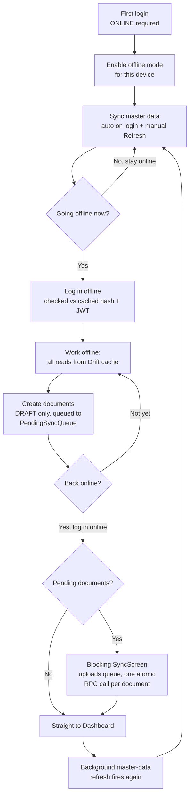
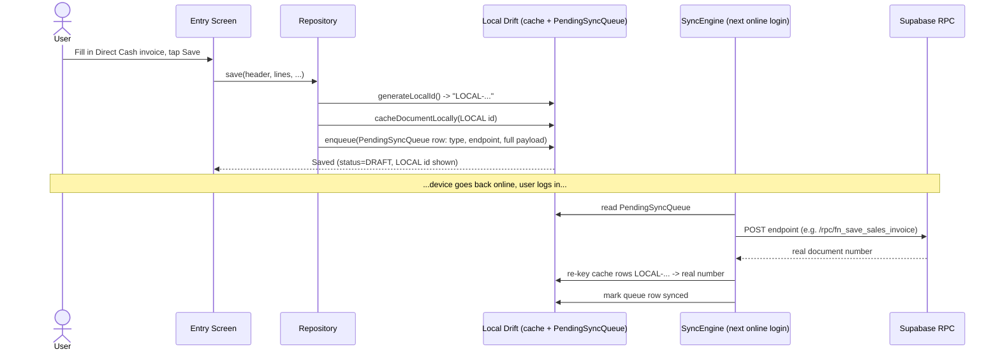

# SAKAL Offline Mode — How It Works

> Mermaid diagrams below render natively on GitHub. In VS Code, install the
> "Markdown Preview Mermaid Support" extension to preview them locally.

SAKAL is built to keep working when a store's internet connection is
unreliable (the DRC/Zambia field reality this app targets). This document
explains the full offline lifecycle end to end, then gives a manual test
checklist for verifying it.

---

## 1. The lifecycle, step by step

1. **First login must be online.** There is no way to create an offline
   session from nothing — `fn_login` needs the server to authenticate and
   issue a JWT. `OfflineSessionCache.save()`
   (`lib/core/services/offline_session_cache.dart`) then caches the
   username, a local password hash, the full `UserSession`, the menu, and
   the JWT to `flutter_secure_storage`.
2. **Enable offline mode for this device.** A per-device toggle on the new
   **Offline Data** screen (`lib/features/setup/presentation/screens/offline_settings_screen.dart`,
   reached from the top-bar avatar menu) — `LocalStorage.deviceOfflineEnabled`,
   stored via `shared_preferences`. Not synced to the server: the same user
   could have offline mode on for a field tablet and off for an office
   desktop.
3. **Sync master data while still online.** Either automatically (every
   online login triggers a background, non-blocking sync via
   `runBackgroundMasterDataSync()`), or manually ("Refresh All" / a
   per-module "Refresh" button on the Offline Settings screen). This
   downloads Products & Pricing, Customers & Suppliers, Locations &
   Currencies, Operational Reference Data, and Sales Invoice Setup into
   local Drift (SQLite) tables — see `lib/core/sync/master_data_modules.dart`.
4. **Log in offline.** Checking "Work Offline" on the login screen checks
   the entered credentials against the cached hash and decodes the cached
   JWT's expiry locally — no network call. If the JWT hasn't expired,
   `offlineMode = true` is set on the session for the rest of that session
   (can't be toggled mid-session — log out and back in online to change it).
5. **Every read now comes from the local cache.** Each offline-capable
   repository branches `if (_isOffline && _local != null) return _local.X(...)`
   — product pickers, customer lookups, tax calculations all read from
   whatever was synced in step 3. A module that was never synced returns an
   empty list, not a crash.
6. **Create a document offline.** Only specific screens support this: Sales
   Invoice (Direct/Cash or Credit only), GRN, Purchase Order, Material
   Requisition/Issue, Stock Transfer (Request/Transfer/Receipt), Purchase
   Return, and Finance Voucher (see the table below). Saving generates a
   temporary `LOCAL-<timestamp>-<random>` id, caches the document locally
   under that id, and writes one row to `PendingSyncQueue` with the full
   payload captured immediately. **Approve/Post never happens offline, for
   any module** — a document can only reach DRAFT while offline.
7. **Reconnect: two independent things happen.**
   - **Upload**: next online login, if `pendingCount() > 0`, the blocking
     `SyncScreen` replays every queued document (`SyncEngine.syncAll()`) —
     one atomic PostgreSQL function call per document. Each synced
     document's `LOCAL-...` placeholder is replaced everywhere by the real
     server-assigned number.
   - **Refresh**: the step-3 background master-data sync fires again, so
     the local cache catches up on anything that changed on the server.
   These are deliberately independent, and there is **no periodic
   background sync** while offline or on flaky connectivity — a silent
   retry loop on an unstable connection just produces repeated failures
   with no clear signal about what succeeded. Syncing happens once,
   consciously, at online login.
8. **The one exception: Quick Invoice's Manager Review.** Sales Invoice's
   "Save" *is* the approve step when online (both RPCs chain in one click).
   Offline, only Save happens — the invoice lands in a real DRAFT once
   synced. A human then reviews it on the **Manager Review** screen
   (always online-only), sees a live stock preview, and posts it — this
   screen doubles as the safety net for the rare case where an *online*
   save succeeds but approve fails right after (e.g. a stock race).

---

## 2. Lifecycle diagram

---

## 3. Sequence diagram — create a document offline, then sync

---

## 4. Which modules support offline document creation

| Module | Offline create? | Notes |
|---|---|---|
| Sales Invoice (Quick Invoice) | **Direct mode only** (Cash or Credit) | Against-Quotation/Order need a live "not already invoiced" check |
| GRN | Yes | |
| Purchase Order | Yes | |
| Material Requisition | Yes | |
| Material Issue | Yes | |
| Stock Transfer Request | Yes | |
| Stock Transfer | Yes | |
| Stock Receipt | Yes | |
| Purchase Return | Yes (only for an already-loaded return — starting a brand-new one needs the supplier/GRN picker, which isn't cached) | |
| Finance Voucher | Yes | Payment modes/currencies intentionally skipped offline — vouchers stay PENDING until synced |
| Sales Invoice Manager Review | No — always online-only | Needs live stock + other counters' status |
| Reports | No | Server aggregation required |
| Master-data maintenance screens | Read-only offline | Add/edit/delete buttons hidden when `offlineMode = true` |

---

## 5. Manual QA checklist

Automated tests (see `test/core/database/master_data_local_ds_test.dart` and
`test/features/sales/sales_invoice_repository_offline_test.dart`) cover the
underlying cache/repository logic. The scenarios below need a real
device/emulator and real connectivity toggling — they can't be faithfully
simulated in a unit test.

- [ ] **Offline Settings**: enable device offline, tap "Refresh All", confirm
      all 5 modules show a real "Last synced" timestamp and a non-zero
      record count.
- [ ] **Offline login — happy path**: log out, check "Work Offline", log in
      with correct credentials, land on Dashboard.
- [ ] **Offline login — wrong password**: rejected locally, no network call.
- [ ] **Offline login — expired cached JWT**: forced back to the online
      login path (can't skip server auth).
- [ ] **Cold-open Quick Invoice offline**: no "Could not load data" error;
      cash customer and cash accounts prefill; Product field shows cached
      products; a known barcode resolves via the cached UOM/barcode table;
      a tax group's computed % matches the last synced rate.
- [ ] **Save offline**: create one Direct Cash and one Direct Credit
      invoice; confirm both show a "pending sync" badge.
- [ ] **Spot-check a second module** (GRN or Material Requisition) opened
      cold offline: its own product/location pickers are populated too.
- [ ] **Reconnect — upload**: log in online, confirm the blocking
      `SyncScreen` uploads both pending invoices, confirm each `LOCAL-...`
      id became a real invoice number everywhere it was shown.
- [ ] **Reconnect — refresh**: confirm the Offline Settings screen's "Last
      synced" timestamps advanced again automatically, with no user action.
- [ ] **Manager Review**: confirm the now-synced invoices appear as DRAFT,
      show a live stock preview, and post successfully.
- [ ] **Edge case — never-synced module**: a module left unsynced shows an
      empty picker offline, not a crash.
- [ ] **Edge case — offline mode left off**: no background sync attempt
      fires at login, no Offline Data drift.
- [ ] **Edge case — Web session**: the "Offline Data" menu item never
      appears; the app stays always-online (no Drift on Flutter Web).

---

## 6. Why this design (not a periodic background sync)

Per the project's own offline-design decisions (agreed 2026-06-18): sync
happens only at a conscious online login, never as a background timer while
offline or on flaky connectivity. Rural DRC/Zambia networks go on/off
silently — a background retry loop just produces repeated failures with no
clear signal to the user about whether their data is actually current. The
user decides when the connection is stable enough by consciously choosing
"online login" — that's also the one moment both the upload and the
master-data refresh are allowed to run.
